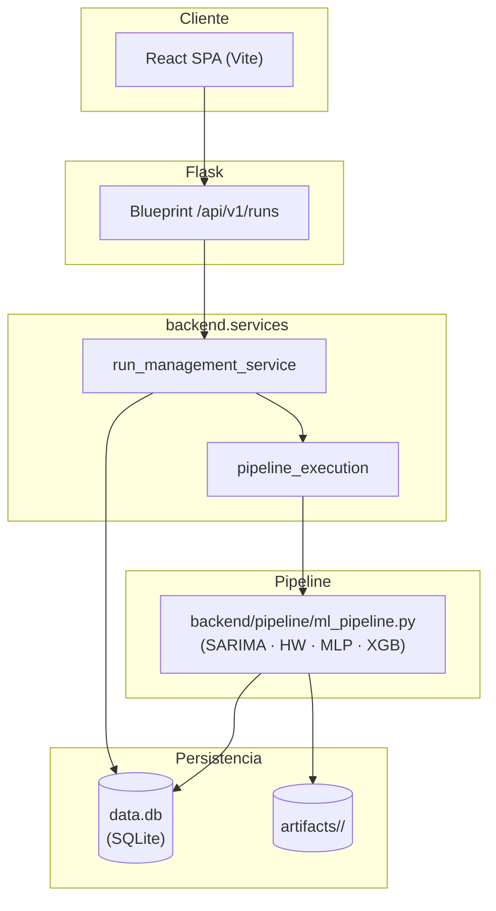

# Proyecto_ML

Aplicación full-stack de Machine Learning para series temporales de delitos (OIJ):
pipeline clásico en Python, API REST en Flask y SPA en React + TypeScript.

## Stack

- **Backend:** Python 3.12, Flask, SQLite, pandas, scikit-learn, statsmodels, XGBoost, Plotly.
- **Frontend:** React 18 + TypeScript + Vite.
- **Persistencia:** SQLite (`data.db`, tablas `delitos` y `runs`).
- **DevOps:** Dockerfile + `docker-compose.yml`, GitHub Actions (lint + tests).

## Estructura

```
Proyecto_ML/
├── backend/                      # API + pipeline + modelos + servicios + persistencia
│   ├── pipeline/
│   │   └── ml_pipeline.py        # Entrenamiento ML (SARIMA, Holt-Winters, MLP, XGBoost)
│   ├── models/
│   │   └── run_history.py        # Tabla runs en data.db
│   ├── services/
│   │   ├── run_management_service.py  # Runs: list/create/rename/delete/clear
│   │   └── pipeline_execution.py      # Subprocess ML + fusión CSV para la API
│   ├── api/
│   │   └── run_routes.py         # Blueprint /api/v1/runs
│   ├── infrastructure/
│   │   └── db.py                 # Acceso SQLite compartido (conexión + tabla delitos)
│   └── main.py                   # Entrypoint Flask (API JSON)
├── frontend/                     # SPA React + TypeScript + Vite
├── tests/                        # Pytest (unit + smoke API)
├── Dockerfile, docker-compose.yml
├── .github/workflows/ci.yml      # CI mínima
├── data/                         # CSV originales (destino de uploads)
└── artifacts/                    # Resultados por ejecución
```

## Cómo correr

### Backend (Flask)

```bash
pip install -r requirements.txt
cp .env.example .env               # editar SECRET_KEY
flask --app backend.main run           # http://127.0.0.1:5000
```

En Windows PowerShell:

```powershell
$env:SECRET_KEY = "dev-secret"
flask --app backend.main run
```

### Frontend (React + TS)

```bash
cd frontend
npm install
npm run dev                        # http://localhost:5173 (proxy a Flask)
```

### Docker

```bash
docker compose up --build          # http://localhost:5000
```

### Tests

```bash
pip install pytest
pytest -q
```

## API v1 (REST)

| Método | Ruta                      | Descripción                                  |
|--------|---------------------------|----------------------------------------------|
| GET    | `/api/v1/runs`            | Lista runs (más reciente primero).           |
| POST   | `/api/v1/runs`            | Ejecuta pipeline (`merge_all` o `dataset`).  |
| POST   | `/api/v1/runs/register`   | Registra un run ya presente en `artifacts/`. |
| PATCH  | `/api/v1/runs/<run_id>`   | Renombra un run.                             |
| DELETE | `/api/v1/runs/<run_id>`   | Elimina run + artefactos.                    |
| DELETE | `/api/v1/runs`            | Limpia todo el historial.                    |
| GET    | `/`                       | Metadatos JSON del servicio (`api`, `ok`).   |

## Environment Variables

Configuración por entorno. Copiar `.env.example` a `.env` y ajustar valores
(`.env` está git-ignorado; `.env.example` es la referencia versionada).

| Variable         | Default       | Descripción                                               |
|------------------|---------------|-----------------------------------------------------------|
| `SECRET_KEY`     | `dev-secret-change-me` | Firma de sesiones Flask (obligatorio en producción). |
| `FLASK_ENV`      | `development` | Modo de ejecución (informativo; no activa debugger).      |
| `FLASK_DEBUG`    | `0`           | `1` activa el modo debug del servidor de desarrollo (`flask run`). |
| `FLASK_RUN_HOST` | `127.0.0.1`   | Host al que hace bind el servidor de desarrollo.          |
| `FLASK_RUN_PORT` | `5000`        | Puerto del servidor.                                      |

## Pipeline ML

`backend/pipeline/ml_pipeline.py` acepta el origen como argumento (ejecutar siempre
desde la raíz del repo para resolver `data/` y `artifacts/`):

- `python -m backend.pipeline.ml_pipeline auto` — SQLite si hay datos; si no, todos los `data/*.csv`.
- `python -m backend.pipeline.ml_pipeline db` — solo SQLite.
- `python -m backend.pipeline.ml_pipeline csv <archivo.csv>` — un único CSV en `data/`.
- `python -m backend.pipeline.ml_pipeline all_csv` — concatena todos los `data/*.csv`
  (modo usado por `POST /api/v1/runs` con `merge_all: true`).

Cada ejecución genera una carpeta `artifacts/<run_id>/` con:

- `meta.json` (modelo ganador, resumen de la corrida).
- `errores_modelos.csv` (WRMSE por modelo).
- `forecast_3m.csv` (pronóstico multi-horizonte).
- `data_limpia.parquet` (dataset saneado).
- HTMLs Plotly (`forecast_band.html`, `correlation_heatmap.html`, etc.).

Los duplicados por `row_hash` no se insertan en la tabla `delitos`.

## Frontend (resumen)

- `/api/v1/runs` → lista con fecha, dataset, modelo ganador y WRMSE.
- Crear / renombrar / eliminar run sin recargar la página.
- UI tema oscuro por defecto; estado vacío cuando no hay artefactos.

## Arquitectura


