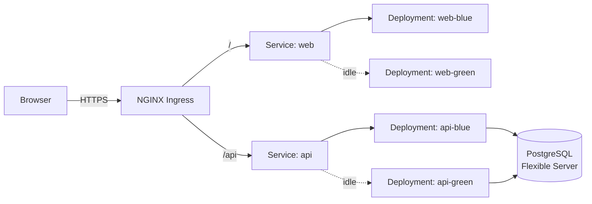

# Proyecto_ML — DevOps / Kubernetes / Azure lab

A two-tier web app re-architected as a **DevOps lab**. The original ML code
lives under [`legacy/`](./legacy) for reference; everything else is new and
focused on **deployability**: containers, Kubernetes, blue/green releases,
Terraform on Azure, and an Azure DevOps multi-stage pipeline.

> Goal: *be the project you want to walk through in a DevOps / SRE interview.*
> Not the project that ships state-of-the-art ML.

## Stack

| Layer            | Choice                                              |
|------------------|-----------------------------------------------------|
| Frontend         | React 18 + TypeScript + Vite, served by **nginx**   |
| Backend          | Flask 3 + Gunicorn, **stateless**                   |
| Database         | PostgreSQL (managed, Azure DB for PostgreSQL Flex)  |
| Container runtime| Docker (multi-stage, non-root, RO root FS)          |
| Registry         | Azure Container Registry                            |
| Orchestrator     | Azure Kubernetes Service (AKS)                      |
| Ingress          | NGINX Ingress Controller                            |
| IaC              | Terraform (azurerm, remote state in Azure Storage)  |
| CI/CD            | Azure DevOps multi-stage YAML + Environments        |
| Release strategy | Blue/Green via Service selector swap                |

## Repository layout

```
app/
  backend/                Flask API (src layout, pytest, Dockerfile, gunicorn)
  frontend/               Vite SPA (TS strict, nginx production image)
infra/
  terraform/              Azure infra (AKS / ACR / Postgres / Storage modules)
  kubernetes/
    base/                 Plain manifests (single color, blue active)
    overlays/blue-green/  Adds the green Deployments
  helm/                   Reserved (not used yet — plain manifests for clarity)
pipelines/                Azure DevOps multi-stage YAML + reusable templates
scripts/                  bluegreen-switch.sh, bluegreen-status.sh, smoke.sh
compose/                  docker-compose for local dev (postgres + api + web)
docs/                     Architecture, deployment, blue/green, terraform, pipelines, ADRs
legacy/                   Original codebase, read-only reference
.tracking/                Dated decision log
.plan, .progress          Phase plan + log
.cursorrules              Engineering & process rules for AI assistants
```

## Architecture



Full diagram + explanation: [`docs/architecture.md`](docs/architecture.md).

## Quick start

### Local — docker compose

```bash
docker compose -f compose/docker-compose.yml up --build
# frontend (nginx + SPA) :  http://localhost:8080
# backend (Flask)        :  http://localhost:8000/healthz
# postgres               :  localhost:5432  (proyectoml/proyectoml)
```

### Local — backend tests

```bash
cd app/backend
python -m venv .venv && source .venv/bin/activate    # PowerShell: .venv\Scripts\Activate.ps1
pip install -r requirements-dev.txt
pytest -q
# 7 passed
```

### Local — frontend dev

```bash
cd app/frontend
npm install
npm run typecheck
npm run dev    # http://localhost:5173, /api proxied to http://127.0.0.1:8000
```

### Kubernetes (kind / minikube / AKS)

```bash
# Pre-req: ingress-nginx in the cluster.
kubectl apply -k infra/kubernetes/overlays/blue-green
kubectl -n proyecto-ml apply -f infra/kubernetes/base/secret.example.yaml   # dev only
kubectl -n proyecto-ml get pods,svc,ing
```

See [`docs/deployment.md`](docs/deployment.md) for the kind/minikube and Azure
walkthroughs.

### Azure infra

```bash
cd infra/terraform
terraform init   -backend-config="resource_group_name=tfstate-rg" \
                 -backend-config="storage_account_name=<account>" \
                 -backend-config="container_name=tfstate" \
                 -backend-config="key=dev.tfstate"
terraform plan   -var-file=envs/dev.tfvars -out=dev.tfplan
terraform apply  dev.tfplan
```

Full reference: [`docs/terraform.md`](docs/terraform.md).

## Blue/Green release

```bash
# CI deploys the new image to the IDLE color (green here).
kubectl -n proyecto-ml set image deploy/api-green api=$ACR/proyecto-ml-api:$SHA
kubectl -n proyecto-ml set image deploy/web-green web=$ACR/proyecto-ml-web:$SHA
kubectl -n proyecto-ml scale deploy/api-green --replicas=2
kubectl -n proyecto-ml scale deploy/web-green --replicas=2
kubectl -n proyecto-ml rollout status deploy/api-green
kubectl -n proyecto-ml rollout status deploy/web-green

# Smoke through the per-color Service.
kubectl -n proyecto-ml port-forward svc/api-green 8001:80 &
scripts/smoke.sh http://localhost:8001
kill %1

# Atomic Service swap.
scripts/bluegreen-switch.sh proyecto-ml green

# Rollback in seconds:
scripts/bluegreen-switch.sh proyecto-ml blue
```

Full reference (incl. database migration discipline + risks):
[`docs/bluegreen.md`](docs/bluegreen.md).

## CI/CD

Azure DevOps multi-stage YAML at [`pipelines/azure-pipelines.yml`](pipelines/azure-pipelines.yml).

```mermaid
flowchart LR
  v[validate] --> t[test]
  t --> b[build_images]
  b --> dev[deploy_dev\n(main only)]
  b --> idle[deploy_prod_idle\n(tag v*)]
  idle --> swap[bluegreen_switch]
```

Approvals are configured at the Environment level in AzDO, not in YAML
([reference](https://learn.microsoft.com/en-us/azure/devops/pipelines/process/approvals?view=azure-devops)).
Setup details: [`docs/pipelines.md`](docs/pipelines.md).

A lightweight GitHub Actions PR gate also runs (`.github/workflows/ci-pr.yml`)
so non-AzDO contributors get the same backend / frontend / kubeconform / tf
fmt checks on PRs.

## What's intentionally **not** here

- Heavy ML (the legacy SARIMAX/XGBoost stack). Replaced by a deterministic
  stub. See [ADR 0002](docs/adr/0002-stateless-api-no-subprocess-ml.md).
- A queue / worker tier. Not needed for the demo's request shape.
- A service mesh. Plain Services + NetworkPolicies are enough.
- GitOps controllers (Argo CD / Flux). The Azure DevOps pipeline is the
  source of truth.
- Key Vault + CSI Secret Store. Listed as an explicit stretch goal.

## Documentation index

- [Architecture](docs/architecture.md)
- [Deployment paths (local / Kubernetes / Azure)](docs/deployment.md)
- [Blue/Green release flow](docs/bluegreen.md)
- [Terraform on Azure](docs/terraform.md)
- [Azure DevOps pipelines](docs/pipelines.md)
- ADRs:
  [0001 Postgres over SQLite](docs/adr/0001-postgres-over-sqlite.md) ·
  [0002 Stateless API, no subprocess ML](docs/adr/0002-stateless-api-no-subprocess-ml.md) ·
  [0003 Blue/Green via Service selector](docs/adr/0003-bluegreen-via-service-selector.md)

## Process / progress files

- [`.plan`](.plan) — phase outline
- [`.progress`](.progress) — phase log
- [`.tracking/notes.md`](.tracking/notes.md) — dated decision log
- [`.cursorrules`](.cursorrules) — rules for AI assistants
