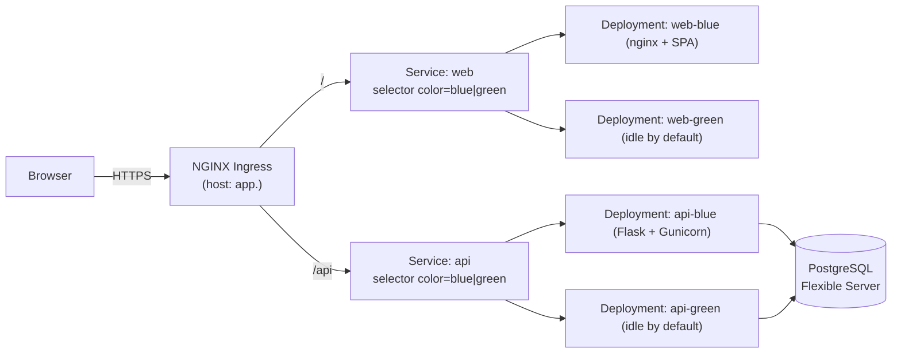

# Architecture

## Goals

- Stateless app tier (any pod can be killed at any time).
- Same-origin in production (Ingress fronts both api and web).
- Blue/green deployable on AKS.
- One Postgres, one Blob, one ACR. No queues, no service mesh.

## Component diagram

The Ingress always points at the **stable** Service names (`web`, `api`). The
two coloured Deployments share the same Service selector `app.kubernetes.io/name`,
and the **`color`** label decides which set of Pods receives traffic. Switching
colours = patching the Service selector. The colored helper Services
(`api-blue`, `api-green`, etc.) only exist for pre-swap smoke tests.

## Request flow

1. Browser hits `https://app.example.com`.
2. Ingress routes:
   - `/` -> `Service/web` -> `web-<active>` Pods.
   - `/api/v1/...` -> `Service/api` -> `api-<active>` Pods (URL is rewritten
     by `nginx.ingress.kubernetes.io/use-regex` + capture group).
3. Backend reads `DATABASE_URL` from a K8s Secret and talks to Postgres over
   the cluster network (managed Azure DB).
4. The SPA's runtime config (`API_BASE = "/api"`) means the same image works
   in dev, compose, and Kubernetes — no per-env rebuilds.

## Statefulness

| Component         | Stateful?                      |
|-------------------|--------------------------------|
| `api` Pods        | No                             |
| `web` Pods        | No                             |
| Postgres (Azure)  | Yes (managed)                  |
| ACR               | Yes (managed)                  |
| Ingress controller | No app state                   |

This is the property that makes blue/green and HPA viable.
