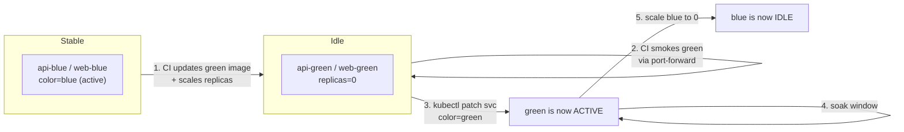

# Blue/Green deployment

## Topology

Two Deployments per app, sharing a single stable Service whose selector
identifies the **active colour**.

```
Service/api  selector: { app.kubernetes.io/name=api,  color=<active> }
   |--> Deployment/api-blue   (color=blue)
   |--> Deployment/api-green  (color=green)

Service/web  selector: { app.kubernetes.io/name=web,  color=<active> }
   |--> Deployment/web-blue   (color=blue)
   |--> Deployment/web-green  (color=green)
```

Colored helper Services (`api-blue`, `api-green`, `web-blue`, `web-green`) are
**not** wired to the Ingress; they exist so the pipeline (and humans) can
smoke-test a colour before swapping.

## Lifecycle



## Rollout (CI does this automatically)

```bash
# Idle is the colour we deploy TO.
kubectl -n proyecto-ml set image deploy/api-green api=$ACR/proyecto-ml-api:$SHA
kubectl -n proyecto-ml set image deploy/web-green web=$ACR/proyecto-ml-web:$SHA
kubectl -n proyecto-ml scale deploy/api-green --replicas=2
kubectl -n proyecto-ml scale deploy/web-green --replicas=2

kubectl -n proyecto-ml rollout status deploy/api-green
kubectl -n proyecto-ml rollout status deploy/web-green

# Smoke through the per-color Service
kubectl -n proyecto-ml port-forward svc/api-green 8001:80 &
scripts/smoke.sh http://localhost:8001
kill %1

# Atomic swap
scripts/bluegreen-switch.sh proyecto-ml green

# Soak, then drain old color
sleep 60
kubectl -n proyecto-ml scale deploy/api-blue --replicas=0
kubectl -n proyecto-ml scale deploy/web-blue --replicas=0
```

## Rollback

```bash
scripts/bluegreen-switch.sh proyecto-ml blue
```

The previous colour's Pods stay around (replicas=0 only after the soak window),
so flipping back is a sub-second operation.

## Database

The two colours share a single Postgres. To stay safe:

- Every release is **expand-only** (additive columns / tables, nullable or with
  defaults).
- The release **after** a colour swap removes the old columns (contract step).
- Migrations run as a **pre-deploy Job** before the new colour is scaled up
  (`helm.sh/hook: pre-install,pre-upgrade` if you adopt Helm).
- Never drop a column in the same release that introduces it elsewhere.

## Risks and mitigations

| Risk                              | Mitigation                                           |
|-----------------------------------|------------------------------------------------------|
| In-flight requests during swap    | Old Pods stay up; `terminationGracePeriodSeconds: 30`|
| Schema breakage between colours   | Expand-only migration discipline; PR check           |
| Accidental dual writes to artifacts | Object keys are run-id-prefixed                    |
| Cost during cutover               | 2x pods only briefly; HPA on idle has min=0          |
| Forgetting to flip `currentColor` / `idleColor` in AzDO variable group | Pipeline reads the var group; document in PR template |

## References

- [Native K8s blue/green via service selectors](https://oneuptime.com/blog/post/2026-02-09-blue-green-deployments-native-kubernetes/view)
- [AKS + NGINX Ingress blue/green](https://oneuptime.com/blog/post/2026-02-16-how-to-implement-blue-green-deployments-on-aks-with-nginx-ingress-annotations/view)
