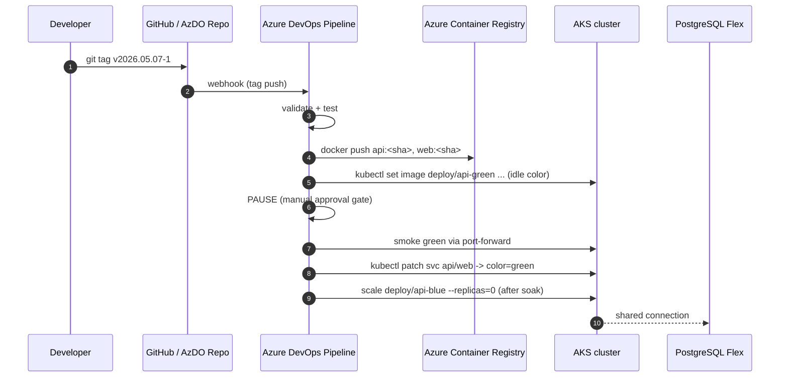

# Deployment

End-to-end deployment paths from a local laptop and from Azure DevOps.

## Local (docker-compose)

```bash
docker compose -f compose/docker-compose.yml up --build
# frontend:  http://localhost:8080
# backend:   http://localhost:8000/healthz
# postgres:  localhost:5432 (proyectoml/proyectoml)
```

Note: the compose stack runs the **production** images. For interactive
frontend dev, prefer `cd app/frontend && npm run dev` against the local backend.

## Local Kubernetes (kind / minikube)

```bash
# 1. Cluster + ingress controller
kind create cluster --name pml
helm repo add ingress-nginx https://kubernetes.github.io/ingress-nginx
helm upgrade --install ingress-nginx ingress-nginx/ingress-nginx \
  --namespace ingress-nginx --create-namespace

# 2. Build images and load them into kind
docker build -t proyecto-ml-api:local app/backend
docker build -t proyecto-ml-web:local app/frontend
kind load docker-image proyecto-ml-api:local proyecto-ml-web:local --name pml

# 3. Apply manifests
kubectl apply -k infra/kubernetes/overlays/blue-green
kubectl -n proyecto-ml apply -f infra/kubernetes/base/secret.example.yaml
```

Then port-forward the Ingress controller and hit `http://localhost:8080`.

## Azure (full path)



Pipeline file: [`pipelines/azure-pipelines.yml`](../pipelines/azure-pipelines.yml).
