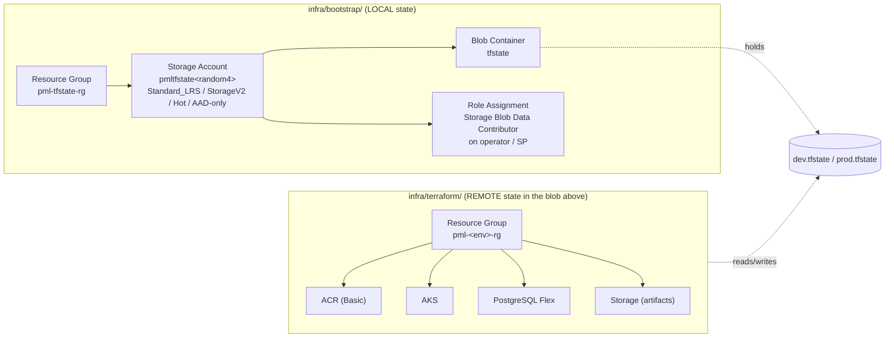

# Terraform — remote-state bootstrap

How to create the Azure resources the `infra/terraform/` stack uses as its
`azurerm` remote-state backend, without falling into the classic chicken-
and-egg problem (`terraform init` needs a backend that does not exist yet).

> Lab project: optimised for **simplicity** and **near-zero Azure cost**
> (~USD 0.02 / month for tfstate-sized blobs). Production hardening notes
> are listed at the bottom.

## TL;DR

```bash
# 1. Bootstrap the backend (one-time, ~30 s).
cd infra/bootstrap
terraform init
terraform apply -auto-approve
terraform output -raw backend_config_dev  > ../terraform/envs/dev.backend.hcl
terraform output -raw backend_config_prod > ../terraform/envs/prod.backend.hcl

# 2. Init the main stack against the freshly-created remote state.
cd ../terraform
terraform init -backend-config=envs/dev.backend.hcl

# 3. Apply main infrastructure.
terraform plan  -var-file=envs/dev.tfvars -out=dev.tfplan
terraform apply dev.tfplan

# 4. Destroy main infra without harming the backend.
../../scripts/tf-destroy-main.sh dev
```

## Architecture

Two **independent** Terraform roots:



Why two roots:

- The bootstrap stack uses **local state**, so `terraform init` works the
  first time without any Azure backend existing.
- The main stack uses the bootstrap-created Blob container as its azurerm
  remote backend, so its state lives in Azure and is shareable.
- A `terraform destroy` of the main stack **cannot** reach the bootstrap
  stack: different root, different Resource Group, `prevent_destroy = true`
  on the storage account and container.

## What gets created

| Resource         | Name                       | SKU / setting                                  | Monthly cost (eastus, est.) |
|------------------|----------------------------|------------------------------------------------|------------------------------|
| Resource Group   | `pml-tfstate-rg`           | n/a                                            | $0.00                        |
| Storage Account  | `pmltfstate<random4>`      | `Standard_LRS`, `StorageV2`, Hot, TLS 1.2, AAD-only | ~$0.02 (capacity + few txn) |
| Blob Container   | `tfstate`                  | private                                        | included                     |
| Role Assignment  | `Storage Blob Data Contributor` | scope = the storage account               | $0.00                        |

Cost rationale:

- **`Standard_LRS`** — locally-redundant storage is the cheapest replication
  tier in Azure. State files are tiny and easily re-derivable, we don't need
  geo-redundancy for a lab.
  Ref: [Azure Storage redundancy](https://learn.microsoft.com/azure/storage/common/storage-redundancy).
- **`StorageV2` (general-purpose v2)** — required for the Blob features the
  azurerm backend relies on (lease-based locking, blob versioning hooks).
- **Hot access tier** — tfstate is read/written on every plan/apply. Hot has
  the lowest *transaction* cost; Cool is cheaper to *store* but more
  expensive to read, which is the wrong trade-off here.
- **No CMK, no private endpoint, no immutable storage, no advanced threat
  protection** — none of these are needed for a lab and each adds cost or
  setup friction.

## Bootstrap flow

You can bootstrap via Terraform (canonical) or Azure CLI (fallback). Both
produce the same RG / SA / container with the same tags, so they are
interchangeable on subsequent runs.

### Path A — Terraform (canonical)

```bash
az login
az account set --subscription <your-sub-id>

cd infra/bootstrap
terraform init
terraform plan  -out=bootstrap.tfplan
terraform apply bootstrap.tfplan

# Materialise the per-env backend-config files for the main stack.
terraform output -raw backend_config_dev  > ../terraform/envs/dev.backend.hcl
terraform output -raw backend_config_prod > ../terraform/envs/prod.backend.hcl
```

State lives at `infra/bootstrap/terraform.tfstate` (local). Keep that file.
If you lose it, re-running `terraform apply` will try to create a *second*
storage account because Terraform no longer knows the random suffix. Use
the az-CLI path or import the existing resources before re-running.

### Path B — Azure CLI (fallback)

```bash
az login
az account set --subscription <your-sub-id>

# Linux / macOS / WSL / Git Bash:
scripts/tf-bootstrap.sh

# Windows PowerShell:
./scripts/tf-bootstrap.ps1
```

The script:

1. Creates `pml-tfstate-rg` if missing.
2. Looks for an existing storage account in that RG with the tag
   `purpose=tfstate-backend`. If one exists, reuses it; otherwise creates
   `pmltfstate<random4>` with the same SKU as the Terraform path.
3. Creates the `tfstate` container via `az storage container-rm create`
   (ARM control plane — does not require a data-plane role to exist yet).
4. Grants `Storage Blob Data Contributor` on the storage account to the
   signed-in principal.
5. Writes `infra/terraform/envs/{dev,prod}.backend.hcl`.

Re-running the script is a no-op.

## Init / plan / apply (main stack)

After either bootstrap path:

```bash
cd infra/terraform

terraform init -backend-config=envs/dev.backend.hcl
terraform plan  -var-file=envs/dev.tfvars -out=dev.tfplan
terraform apply dev.tfplan
```

The state blob lands at `tfstate/dev.tfstate` in the bootstrap-created
storage account.

For prod:

```bash
terraform init -reconfigure -backend-config=envs/prod.backend.hcl
terraform plan  -var-file=envs/prod.tfvars -out=prod.tfplan
terraform apply prod.tfplan
```

`-reconfigure` is needed when you switch which `.backend.hcl` file you use
inside the same working directory; otherwise Terraform will try to migrate
state between backends, which we explicitly do not want here.

## Migration: local state → remote state

Only relevant if you were already running the main stack against a local
state file (i.e. there is a `infra/terraform/terraform.tfstate` next to
`main.tf`). After bootstrap:

```bash
cd infra/terraform

terraform init -migrate-state -backend-config=envs/dev.backend.hcl
# Terraform asks:
#   "Do you want to copy existing state to the new backend?"  -> yes
```

`-migrate-state` copies the local `terraform.tfstate` into the azurerm
backend (key = `dev.tfstate`) and then leaves the local file in place
**without** deleting it. Verify the remote state is healthy first, then:

```bash
# Sanity check.
terraform state list                       # should list AKS, ACR, Postgres, ...
terraform plan -var-file=envs/dev.tfvars   # should be a no-op

# Once you're confident, archive the local file out of the working tree.
mv terraform.tfstate ../../.local-tfstate-backup-$(date +%F)
```

If you never had a local state (the prompts you saw on `terraform init`
appeared because the backend itself was missing), you do **not** need to
migrate. Just run `terraform init -backend-config=envs/dev.backend.hcl`
after bootstrap and Terraform will start with an empty remote state.

Ref: [Backend configuration — initializing](https://developer.hashicorp.com/terraform/language/backend#changing-configuration).

## Destroy strategy

Two distinct concepts:

### Destroying the main stack (routine)

```bash
scripts/tf-destroy-main.sh dev
```

The wrapper:

1. Verifies `envs/dev.tfvars` and `envs/dev.backend.hcl` exist.
2. Runs `terraform state list` and **aborts** if any token resembling a
   bootstrap resource (`tfstate-rg`, `tfstate`,
   `azurerm_role_assignment.tfstate`) appears in the main-stack state.
   That should never happen, but if a misconfiguration ever moved a
   bootstrap resource into the main state, this prevents catastrophe.
3. Prompts you to type the env name to confirm.
4. Runs `terraform destroy -var-file=envs/dev.tfvars -auto-approve`.

The bootstrap RG, storage account, container, role assignment, and remote
tfstate blob are untouched.

### Destroying the bootstrap stack (rare, intentional)

You almost never want to do this — it deletes the remote state for every
environment. To do it on purpose:

```bash
cd infra/bootstrap

# 1. Remove the prevent_destroy lifecycle blocks from main.tf temporarily
#    (storage account + container).
# 2. Plan and review.
terraform plan -destroy -out=bootstrap-destroy.tfplan
terraform apply bootstrap-destroy.tfplan

# 3. Restore the prevent_destroy blocks in git so the next operator
#    inherits the safety net.
git checkout -- main.tf
```

If main-stack environments still exist, destroy them first or you will
orphan their cloud resources (the resources themselves are unaffected by
losing tfstate; you just lose the Terraform-managed view of them).

## Troubleshooting

### `terraform init` keeps prompting for backend values

Cause: the `.backend.hcl` file does not exist or is empty. The bootstrap
step has not been run, or the output redirection failed.

Fix:

```bash
ls -l infra/terraform/envs/dev.backend.hcl
cat   infra/terraform/envs/dev.backend.hcl   # should show the four values
```

If empty, re-run the bootstrap (Path A or Path B above).

### `Error: AuthorizationFailed` / 403 on `terraform init`

Cause: the signed-in principal does not yet have
`Storage Blob Data Contributor` on the storage account, or the role
assignment has not propagated.

Fix:

```bash
# Confirm the role exists.
az role assignment list \
  --assignee $(az ad signed-in-user show --query id -o tsv) \
  --scope $(az storage account show -g pml-tfstate-rg \
              -n pmltfstate<random4> --query id -o tsv) \
  -o table

# If empty, create it:
az role assignment create \
  --role "Storage Blob Data Contributor" \
  --assignee $(az ad signed-in-user show --query id -o tsv) \
  --scope $(az storage account show -g pml-tfstate-rg \
              -n pmltfstate<random4> --query id -o tsv)

# Then wait 1-2 minutes and re-run:
terraform init -backend-config=envs/dev.backend.hcl
```

Ref: [Backend Type: azurerm — Storage Blob Data Contributor](https://developer.hashicorp.com/terraform/language/backend/azurerm#storage-blob-data-contributor).

### `Error: storage account name is already in use`

Cause: the random 4-char suffix collided with somebody else's account in
Azure's global namespace.

Fix: re-run `terraform apply` in `infra/bootstrap/`. The `random_string`
resource will roll a new suffix on the next plan if the old SA never made
it into state. If it did, taint and re-create:

```bash
cd infra/bootstrap
terraform taint random_string.suffix
terraform apply
```

### `Error: this resource has lifecycle.prevent_destroy set`

Cause: somebody ran `terraform destroy` against `infra/bootstrap/` (which
is exactly what `prevent_destroy` is there to prevent).

Fix: don't. If you are *intentionally* tearing down the backend, follow
the "Destroying the bootstrap stack" procedure above.

### Switching environments leaves the wrong state attached

Symptom: ran `terraform init -backend-config=envs/dev.backend.hcl`, then
`terraform init -backend-config=envs/prod.backend.hcl` complains about a
state migration prompt.

Fix: pass `-reconfigure` whenever you swap which backend-config file you
use in the same working directory:

```bash
terraform init -reconfigure -backend-config=envs/prod.backend.hcl
```

## Safety properties (summary)

- **Separate roots** — bootstrap has its own Terraform root; main stack
  cannot include it in a plan or destroy.
- **Separate Resource Group** — `pml-tfstate-rg` vs `pml-<env>-rg`. A
  resource-group-scoped destroy can never reach the backend.
- **`prevent_destroy = true`** — on `azurerm_storage_account.tfstate`
  and `azurerm_storage_container.tfstate`. Casual `terraform destroy`
  fails with a clear error.
- **Pre-flight scan** — `scripts/tf-destroy-main.sh` blocks destroy if
  bootstrap-resource tokens leak into the main state.
- **AAD-only** — `shared_access_key_enabled = false` on the storage
  account, `use_azuread_auth = true` on the backend. No long-lived keys
  in source or in env files.
- **Soft-delete** — 7-day blob soft delete + 7-day container soft delete
  on the storage account. An accidental blob delete is recoverable.

## CI / pipeline notes (follow-up)

For Azure DevOps, the pipeline service connection should be granted
`Storage Blob Data Contributor` on the bootstrap storage account once. The
pipeline's `terraform init` then uses workload-identity federation:

```hcl
# Example for AzDO; not committed, lives in the pipeline template.
terraform {
  backend "azurerm" {
    use_oidc                         = true
    use_azuread_auth                 = true
    oidc_azure_service_connection_id = "$(AzureSubscriptionServiceConnectionId)"
    # rest comes from -backend-config in the pipeline step
  }
}
```

Refs:
- [HashiCorp — Microsoft Entra ID with OIDC for Azure DevOps](https://developer.hashicorp.com/terraform/language/backend/azurerm#example-configuration-for-azure-devops).

This is **not** wired up in this lab (the operator runs Terraform from
their workstation via `az login`). It is documented here so the next
iteration can drop the pipeline step in without re-doing the bootstrap.

## Production hardening (out of scope for this lab)

- Move the bootstrap stack's own state into the same blob container under
  key `bootstrap.tfstate` once it exists (`terraform init -migrate-state`
  inside `infra/bootstrap/`), and remove the local state file.
- Enable a private endpoint on the storage account and disable public
  network access (`public_network_access_enabled = false`).
- Use `account_replication_type = "ZRS"` (zone-redundant) or `GZRS` for
  multi-AZ / multi-region durability.
- Enable customer-managed keys on the storage account.
- Lock the resource group (`az lock create --lock-type CanNotDelete ...`).
- Issue per-environment containers (`tfstate-dev`, `tfstate-prod`) instead
  of one container with two keys, and grant the dev pipeline access to
  only the dev container.

## References

- HashiCorp — [Backend Type: azurerm](https://developer.hashicorp.com/terraform/language/backend/azurerm)
- Microsoft Learn — [Store Terraform state in Azure Storage](https://learn.microsoft.com/azure/developer/terraform/store-state-in-azure-storage)
- Microsoft Learn — [Storage redundancy options](https://learn.microsoft.com/azure/storage/common/storage-redundancy)
- HashiCorp — [Backend block — partial configuration](https://developer.hashicorp.com/terraform/language/backend#partial-configuration)
- HashiCorp — [Migrating state between backends](https://developer.hashicorp.com/terraform/language/backend#changing-configuration)
